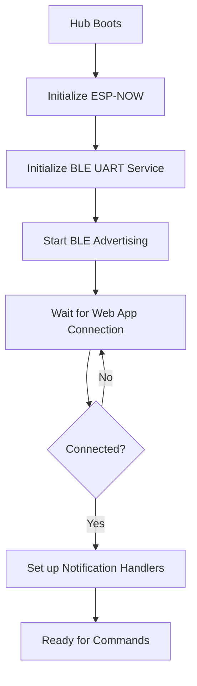
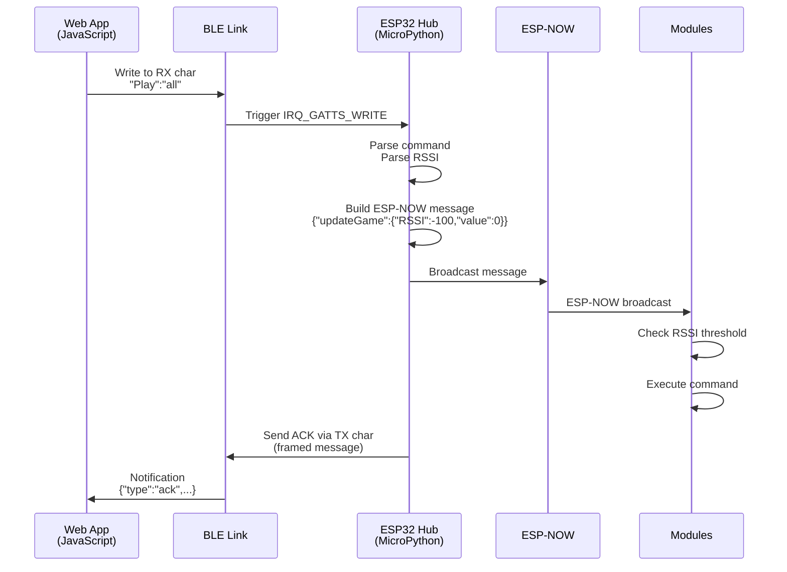
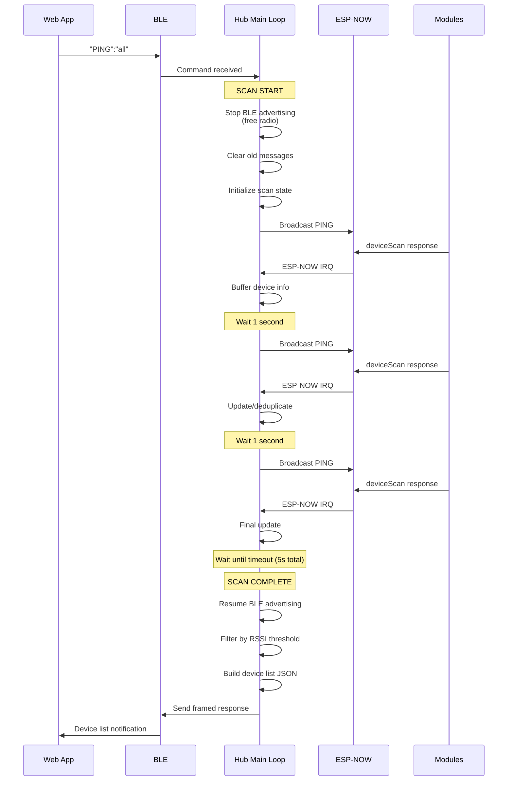

# BLE Protocol Documentation - Hub Version 1
## Smart Playground Control System

**Document Version:** 1.0  
**Date:** December 2, 2025  
**Hub Version:** ESP32C3/C3 MicroPython (v1 - Prior Implementation)  
**Status:** Deprecated (To Be Replaced, Works with Hub to WebApp not Plushie Module v2 )

---

## Table of Contents

1. [Overview](#overview)
2. [BLE Service Architecture](#ble-service-architecture)
3. [Connection Flow](#connection-flow)
4. [Message Framing Protocol](#message-framing-protocol)
5. [Command Protocol](#command-protocol)
6. [Response Protocol](#response-protocol)
7. [Device Scanning Protocol](#device-scanning-protocol)
8. [Implementation Details](#implementation-details)
9. [Timing and Synchronization](#timing-and-synchronization)
10. [Error Handling](#error-handling)

---

## Overview

The Smart Playground Control system uses Bluetooth Low Energy (BLE) to bridge a web application with ESP32-based playground modules. The architecture consists of:

- **Web Application**: PyScript/JavaScript running in browser
- **Hub Device**: ESP32C3/C6 running MicroPython with BLE and ESP-NOW
- **Playground Modules**: ESP32-based devices communicating via ESP-NOW

The hub acts as a **BLE-to-ESP-NOW bridge**, enabling the web app to control modules that are not directly BLE-capable.

### Key Protocol Features

- ✅ **Nordic UART Service** for BLE communication
- ✅ **Message Framing** to handle large payloads over BLE MTU limits
- ✅ **Bidirectional** communication (commands and responses)
- ✅ **RSSI-based filtering** for proximity-aware control
- ✅ **Redundant scanning** to overcome RF interference
- ✅ **Radio time-sharing** between BLE and ESP-NOW on shared hardware

---

## BLE Service Architecture

### Nordic UART Service (NUS)

The protocol uses the standard Nordic UART Service for BLE communication:

| Component | UUID | Direction | Purpose |
|-----------|------|-----------|---------|
| **Service** | `6E400001-B5A3-F393-E0A9-E50E24DCCA9E` | - | Nordic UART Service |
| **TX Characteristic** | `6E400003-B5A3-F393-E0A9-E50E24DCCA9E` | Hub → App | Notifications from hub to web app |
| **RX Characteristic** | `6E400002-B5A3-F393-E0A9-E50E24DCCA9E` | App → Hub | Write commands from web app to hub |

### Naming Convention Clarification

⚠️ **Important**: TX/RX naming is from the **hub's perspective**:
- **TX** = Hub transmits (app receives notifications)
- **RX** = Hub receives (app writes data)

### BLE Connection Properties

```python
# Hub Implementation (MicroPython)
_FLAG_WRITE = 0x0008          # RX characteristic allows writes
_FLAG_NOTIFY = 0x0010         # TX characteristic sends notifications

# Advertising interval
ADVERTISING_INTERVAL = 30000  # 30ms (in microseconds)

# MTU Considerations
BLE_MTU_TYPICAL = 20-244 bytes  # Depends on device negotiation
CHUNK_SIZE = 100 bytes          # Conservative chunking for compatibility
```

---

## Connection Flow

### 1. Hub Initialization



**Hub Startup Sequence:**

```python
# 1. Initialize ESP-NOW on WiFi channel 1
sta = network.WLAN(network.WLAN.IF_STA)
sta.active(True)
sta.config(channel=1)
espnow_interface = espnow.ESPNow()
espnow_interface.active(True)

# 2. Initialize BLE UART
ble = Yell("SPHub", verbose=True)  # Advertises as "SPHub"

# 3. Register interrupt handlers
espnow_interface.irq(espnow_recv_cb)  # ESP-NOW receiver
ble._write_callback = handle_cmd      # BLE command handler

# 4. Start advertising
ble.advertise()  # Device now visible to web app
```

### 2. Web App Connection

```javascript
// Web App Connection Flow (PyScript/Python)

// 1. Request device from browser
const result = await PyBridge.connectHub();

// 2. Browser shows device picker with "SPHub" device
// 3. User selects hub device
// 4. Web Bluetooth API establishes GATT connection

// 5. Python backend discovers services/characteristics
service = await server.getPrimaryService('6e400001-...')
tx_char = await service.getCharacteristic('6e400003-...')  
rx_char = await service.getCharacteristic('6e400002-...')

// 6. Enable notifications for receiving hub responses
await tx_char.startNotifications()
tx_char.addEventListener('characteristicvaluechanged', on_data_callback)

// 7. Connection established - ready to send commands
```

### 3. Connection State Machine

```
[Disconnected] 
    ↓ (User clicks "Connect")
[Connecting] 
    ↓ (Device selected)
[GATT Connection]
    ↓ (Service discovery)
[Characteristic Setup]
    ↓ (Notifications enabled)
[Connected] ←→ [Active Communication]
    ↓ (Disconnect/Error)
[Disconnected]
```

**JavaScript State Tracking:**

```javascript
// State management in main.js
state = {
    hubConnected: false,      // Connection status
    hubDeviceName: null,      // Connected device name
    hubConnecting: false,     // Connection in progress
    // ...
}

// Connection status is source of truth
async function syncConnectionState() {
    const status = await PyBridge.getConnectionStatus();
    setState({
        hubConnected: status.connected,
        hubDeviceName: status.device
    });
}
```

---

## Message Framing Protocol

### Problem: BLE MTU Limitations

BLE characteristics have limited MTU (Maximum Transmission Unit), typically 20-244 bytes. Device lists and responses can exceed this, requiring **message framing** to reassemble fragments.

### Framing Format

```
MSG:<length>|<payload>
```

**Components:**
- `MSG:` - Fixed header identifier (4 bytes)
- `<length>` - Decimal payload length in bytes (variable)
- `|` - Delimiter (1 byte)
- `<payload>` - Actual message content (exact length specified)

### Example: Device List Response

```
Fragment 1: "MSG:330|"
Fragment 2: '{"type":"devices","list":[{"id":"Module1","rssi":-45,"ba'
Fragment 3: 'ttery":85,"type":"module","mac":"aabbccddee01"},{"id":"Mod'
Fragment 4: 'ule2","rssi":-52,"battery":72,"type":"module","mac":"aabb'
Fragment 5: 'ccddee02"}]}'
```

**Total:** 330 bytes payload sent in 5 BLE notifications

### State Machine for Frame Reception

**Hub Transmission (MicroPython):**

```python
def send_ble_framed(self, data_bytes, chunk_size=100):
    """Send data via BLE with message framing"""
    payload_length = len(data_bytes)
    header = f"MSG:{payload_length}|".encode()
    
    # 1. Send header
    self.ble.send(header)
    time.sleep_ms(20)  # Inter-chunk delay
    
    # 2. Send payload in chunks
    for i in range(0, payload_length, chunk_size):
        chunk = data_bytes[i:i+chunk_size]
        self.ble.send(chunk)
        time.sleep_ms(20)
    
    return True
```

**Web App Reception (Python in Browser):**

```python
# State machine for reassembling framed messages
_frame_state = "waiting_header"  # States: waiting_header, receiving_payload
_expected_payload_length = 0
_payload_buffer = ""
_frame_buffer = ""

def on_ble_data(data):
    """Handle incoming BLE notification fragments"""
    global _frame_state, _expected_payload_length, _payload_buffer
    
    if _frame_state == "waiting_header":
        _frame_buffer += data
        
        # Look for header: MSG:<length>|
        if "MSG:" in _frame_buffer and "|" in _frame_buffer:
            header_start = _frame_buffer.index("MSG:")
            header_end = _frame_buffer.index("|", header_start)
            
            # Parse payload length
            length_str = _frame_buffer[header_start + 4:header_end]
            _expected_payload_length = int(length_str)
            
            # Start receiving payload
            _payload_buffer = _frame_buffer[header_end + 1:]
            _frame_state = "receiving_payload"
    
    elif _frame_state == "receiving_payload":
        _payload_buffer += data
        
        # Check if complete
        if len(_payload_buffer) >= _expected_payload_length:
            complete_payload = _payload_buffer[:_expected_payload_length]
            process_complete_message(complete_payload)
            
            # Reset for next message
            _frame_state = "waiting_header"
            _payload_buffer = ""
            _frame_buffer = ""
```

### Timeout Handling

```python
_buffer_timeout = 2.0  # 2 seconds
_last_fragment_time = 0

# Reset buffers if no data received for 2 seconds
if (current_time - _last_fragment_time) > _buffer_timeout:
    _frame_state = "waiting_header"
    _frame_buffer = ""
    _payload_buffer = ""
```

---

## Command Protocol

### Command Format

Commands from web app to hub use a simple colon-delimited format:

```
"<command>":"<rssi_threshold>"
```

**Examples:**
```
"Play":"all"           # Play command, all modules
"Pause":"-50"          # Pause command, RSSI >= -50 dBm
"PING":"all"           # Device scan, all modules
"Win":"-70"            # Win animation, RSSI >= -70 dBm
```

### Supported Commands

| Command | Description | ESP-NOW Mapping | Value |
|---------|-------------|-----------------|-------|
| `Play` | Start game/activity | `updateGame` | 0 |
| `Pause` | Pause/stop activity | `lightOff` | 0 |
| `Win` | Victory animation | `rainbow` | 0 |
| `Color Game` | Start color game | `updateGame` | 1 |
| `Number Game` | Start number game | `updateGame` | 2 |
| `Off` | Deep sleep (power off) | `deepSleep` | 0 |
| `PING` | Device discovery scan | `pingCall` | "app" |

### RSSI Threshold Values

The RSSI threshold controls which modules respond based on signal strength:

```python
# Web app range slider: 1-100
# Maps to RSSI: -90 dBm (far) to -30 dBm (close)

def slider_to_rssi(slider_value):
    if slider_value == 100:
        return "all"  # No filtering
    else:
        return -30 - ((slider_value - 1) / 98) * 60
        
# Examples:
# slider = 1   → RSSI = -90 dBm (farthest)
# slider = 50  → RSSI = -60 dBm (medium)
# slider = 100 → RSSI = "all" (no filter)
```

### Command Parsing (Hub Side)

```python
def parse_web_command(self, command_str):
    """Parse command format: "command":"rssi_threshold" """
    # Handle quoted format: '"Play":"all"'
    if command_str.startswith('"') and command_str.endswith('"'):
        inner = command_str[1:-1]
        if '":"' in inner:
            command, threshold = inner.split('":"', 1)
            return command, threshold
    
    # Handle unquoted format: 'Play":"all'
    elif '":"' in command_str:
        command, threshold = command_str.split('":"', 1)
        return command, threshold
    
    # Default: no threshold
    else:
        return command_str, "all"
```

### ESP-NOW Message Construction

```python
def send_espnow_command(self, command, rssi_threshold="all"):
    """Send command to modules via ESP-NOW broadcast"""
    
    # 1. Map web command to ESP-NOW command
    espnow_command = self.COMMAND_MAP[command]  # e.g., "Play" → "updateGame"
    
    # 2. Convert RSSI threshold to integer
    rssi_value = -100 if rssi_threshold == "all" else int(rssi_threshold)
    
    # 3. Determine command value
    if espnow_command == "updateGame":
        value = self.GAME_VALUES.get(command, 0)  # Play=0, Color=1, Number=2
    elif espnow_command == "pingCall":
        value = "app"
    else:
        value = 0
    
    # 4. Build JSON message for ESP-NOW
    message = {
        espnow_command: {
            "RSSI": rssi_value,
            "value": value
        }
    }
    
    # 5. Broadcast via ESP-NOW
    message_str = json.dumps(message)
    success = self.espnow_interface.send(BROADCAST_MAC, message_str)
    
    return success
```

**Example ESP-NOW Messages:**

```json
// Play command (all modules)
{"updateGame": {"RSSI": -100, "value": 0}}

// Pause command (RSSI >= -50 dBm)
{"lightOff": {"RSSI": -50, "value": 0}}

// PING for device scan (all modules)
{"pingCall": {"RSSI": -100, "value": "app"}}

// Win animation (RSSI >= -70 dBm)
{"rainbow": {"RSSI": -70, "value": 0}}
```

### Command Flow Diagram



---

## Response Protocol

### Response Message Types

All responses from hub to app are **JSON-formatted** and **framed** using the message framing protocol.

#### 1. Device List Response

Sent in response to `PING` command after device scan completes.

```json
{
    "type": "devices",
    "list": [
        {
            "id": "Module1",
            "rssi": -45,
            "battery": 85,
            "type": "module",
            "mac": "aabbccddee01"
        },
        {
            "id": "Module2",
            "rssi": -52,
            "battery": 72,
            "type": "module",
            "mac": "aabbccddee02"
        }
    ]
}
```

**Fields:**
- `type`: Always `"devices"` for device lists
- `list`: Array of discovered modules
  - `id`: Module identifier (from module's response)
  - `rssi`: Received Signal Strength Indicator (dBm)
  - `battery`: Battery percentage (0-100)
  - `type`: Module type (usually `"module"`)
  - `mac`: MAC address (hex string)

**Processing (Web App):**

```python
def process_complete_message(message_data):
    parsed = json.loads(message_data)
    
    if parsed.get("type") == "devices":
        device_list = parsed.get("list", [])
        
        # Deduplicate by MAC address
        seen_macs = set()
        unique_devices = []
        for dev in device_list:
            mac = dev.get("mac", "")
            if mac and mac not in seen_macs:
                seen_macs.add(mac)
                unique_devices.append(dev)
        
        # Convert to UI format with signal bars and battery levels
        for dev in unique_devices:
            rssi = dev.get("rssi", -100)
            
            # Calculate signal strength (0-3 bars)
            if rssi >= -50:
                signal = 3
            elif rssi >= -70:
                signal = 2
            elif rssi >= -85:
                signal = 1
            else:
                signal = 0
            
            # Calculate battery level
            battery_pct = dev.get("battery", 50)
            if battery_pct >= 75:
                battery = "full"
            elif battery_pct >= 50:
                battery = "high"
            elif battery_pct >= 25:
                battery = "medium"
            else:
                battery = "low"
            
            # Add to UI device list
            devices.append({
                "id": dev["id"],
                "name": dev["id"],
                "rssi": rssi,
                "signal": signal,
                "battery": battery
            })
        
        # Update JavaScript UI
        window.onDevicesUpdated(to_js(devices))
```

#### 2. Acknowledgment Response

Sent immediately after command is transmitted via ESP-NOW.

```json
{
    "type": "ack",
    "command": "Play",
    "status": "sent",
    "rssi": "all"
}
```

**Fields:**
- `type`: Always `"ack"`
- `command`: Original command that was sent
- `status`: `"sent"` (success) or `"failed"` (error)
- `rssi`: RSSI threshold that was used

**Processing (Web App):**

```python
if parsed.get("type") == "ack":
    command = parsed.get("command", "unknown")
    status = parsed.get("status", "unknown")
    
    if status == "sent":
        console.log(f"✓ Command '{command}' sent successfully")
    else:
        console.log(f"✗ Command '{command}' failed to send")
```

#### 3. Error Response

Sent when hub encounters an error processing a command.

```json
{
    "type": "error",
    "message": "Unknown command: Test",
    "available_commands": [
        "Play", "Pause", "Win", "Color Game",
        "Number Game", "Off", "PING"
    ]
}
```

**Fields:**
- `type`: Always `"error"`
- `message`: Human-readable error description
- `available_commands`: Optional list of valid commands

**Processing (Web App):**

```python
if parsed.get("type") == "error":
    error_msg = parsed.get("message", "Unknown error")
    console.log(f"Hub error: {error_msg}")
    
    # Show error toast to user
    if hasattr(window, 'showToast'):
        window.showToast(error_msg, "error")
```

---

## Device Scanning Protocol

Device scanning is the most complex operation, requiring careful **radio time-sharing** between BLE and ESP-NOW on the ESP32-C3's shared 2.4GHz radio.

### Radio Conflict Problem

**Issue:** ESP32-C3 has a single 2.4GHz radio shared by both BLE and ESP-NOW:
- BLE advertising/notifications interfere with ESP-NOW IRQ
- ESP-NOW message reception can be blocked by BLE traffic
- Concurrent use leads to message loss and timeouts

**Solution:** Temporarily stop BLE advertising during ESP-NOW scan, resume after completion.

### Scan Sequence



### Redundant PING Strategy

To overcome RF interference and packet loss, the hub sends **multiple redundant PINGs**:

```python
# Scan configuration
self.scan_redundancy_count = 3      # Send 3 PINGs
self.scan_redundancy_delay = 1.0    # 1 second apart
self.device_scan_timeout = 5.0      # Total scan duration
```

**Timeline:**
```
T=0.0s: Send PING #1, start scan timer
T=1.0s: Send PING #2 (redundant)
T=2.0s: Send PING #3 (redundant)
T=5.0s: Scan timeout, finish scan
```

**Why redundant PINGs?**
- ESP-NOW is unreliable in noisy RF environments
- Modules may miss first PING due to their own operations
- Multiple PINGs ensure all reachable modules respond
- Responses are deduplicated by MAC address

### Scan Implementation (Hub)

```python
def start_device_scan(self, rssi_threshold="all"):
    """Start device scan with redundant PINGs"""
    
    # 1. Prevent overlapping scans
    if self.scan_in_progress:
        print("WARNING: Scan already in progress!")
        return
    
    # 2. Stop BLE advertising (critical for ESP32-C3)
    print("Stopping BLE advertising to free radio for ESP-NOW...")
    self.ble.stop_advertising()
    time.sleep_ms(100)
    
    # 3. Clear old ESP-NOW messages from buffer
    espnow_msg_buffer.clear()
    
    # 4. Initialize scan state
    self.scan_in_progress = True
    self.scan_start_time = time.time()
    self.scan_rssi_threshold = rssi_threshold
    self.discovered_devices = []
    self.ble_paused = True
    self.scan_ping_counter = 0
    
    # 5. Send first PING immediately
    self.send_espnow_command("PING", rssi_threshold)
    self.scan_ping_counter = 1
    self.last_ping_time = time.time()
    
    print(f"Sent PING 1/{self.scan_redundancy_count}")

def check_scan_progress(self, current_time):
    """Main loop calls this to manage scan progression"""
    elapsed = current_time - self.scan_start_time
    
    # Send additional redundant PINGs
    if self.scan_ping_counter < self.scan_redundancy_count:
        time_since_last_ping = current_time - self.last_ping_time
        if time_since_last_ping >= self.scan_redundancy_delay:
            self.send_espnow_command("PING", self.scan_rssi_threshold)
            self.scan_ping_counter += 1
            self.last_ping_time = current_time
            print(f"Sent redundant PING {self.scan_ping_counter}/{self.scan_redundancy_count}")
    
    # Check timeout
    if elapsed > self.device_scan_timeout:
        self.finish_device_scan()

def handle_device_scan(self, mac, data):
    """Process deviceScan response from module (called by ESP-NOW IRQ)"""
    if not self.scan_in_progress:
        return  # Ignore stray responses
    
    # Get RSSI from peers table
    rssi = self.espnow_interface.peers_table[mac][0]
    mac_hex = mac.hex()
    
    # Deduplicate by MAC, keep strongest RSSI
    existing_device = None
    for device in self.discovered_devices:
        if device["mac"] == mac_hex:
            existing_device = device
            break
    
    if existing_device:
        # Update RSSI if stronger (module moved closer or better link)
        if rssi > existing_device["rssi"]:
            existing_device["rssi"] = rssi
    else:
        # New device discovered
        device_info = {
            "id": data.get("value", "M-" + mac_hex[:6]),
            "rssi": rssi,
            "battery": data.get("battery", -1),
            "type": data.get("type", "Unknown"),
            "mac": mac_hex
        }
        self.discovered_devices.append(device_info)

def finish_device_scan(self):
    """Complete scan and send results to app"""
    print(f"SCAN COMPLETE - {len(self.discovered_devices)} unique devices found")
    
    self.scan_in_progress = False
    
    # Resume BLE advertising (critical!)
    self.ble_paused = False
    print("Resuming BLE advertising...")
    self.ble.advertise()
    time.sleep_ms(100)
    
    # Apply RSSI filtering (client-side for redundancy)
    if self.scan_rssi_threshold != "all":
        threshold_val = int(self.scan_rssi_threshold)
        self.discovered_devices = [
            d for d in self.discovered_devices 
            if d["rssi"] >= threshold_val
        ]
    
    # Build and send device list response
    device_list_response = {
        "type": "devices",
        "list": self.discovered_devices
    }
    
    response_json = json.dumps(device_list_response)
    response_bytes = response_json.encode()
    
    # Send via BLE with framing
    self.send_ble_framed(response_bytes, chunk_size=100)
```

### Scan Timeout and Watchdog

```python
def check_scan_progress(self, current_time):
    elapsed = current_time - self.scan_start_time
    
    # Watchdog: force reset if scan stuck >10s
    if elapsed > (self.device_scan_timeout * 2):
        print(f"!!! WATCHDOG: Scan stuck for {elapsed:.1f}s! Force resetting...")
        self.scan_in_progress = False
        self.ble_paused = False
        espnow_msg_buffer.clear()
        self.ble.advertise()
        print("State forcibly reset. System recovered.")
```

### Web App Scan Handling

```javascript
async function handleRefreshDevices(rssiThreshold = null, retryCount = 0) {
    // 1. Prevent concurrent scans
    if (state.isRefreshing && retryCount === 0) {
        console.log("Refresh already in progress");
        return;
    }
    
    // 2. Calculate RSSI threshold from slider
    if (rssiThreshold === null) {
        const sliderPosition = state.range;
        if (sliderPosition === 100) {
            rssiThreshold = "all";
        } else {
            rssiThreshold = Math.round(-30 - ((sliderPosition - 1) / 98) * 60);
        }
    }
    
    // 3. Set loading state
    setState({ isRefreshing: true });
    
    // 4. Set timeout (7 seconds: 5s scan + 2s buffer for BLE resume/response)
    this.refreshTimeout = setTimeout(() => {
        console.warn("⚠️ Refresh timeout: No response within 7s");
        setState({ isRefreshing: false });
    }, 7000);
    
    // 5. Send PING command
    try {
        const result = await PyBridge.refreshDevices(rssiThreshold);
        console.log("✓ PING sent, waiting for device responses...");
        
        // Note: isRefreshing will be cleared by onDevicesUpdated callback
        // when hub sends back device list, OR by timeout
        
    } catch (e) {
        // Handle GATT errors with retry logic
        if (e.isGattError && retryCount < MAX_GATT_RETRIES) {
            console.warn(`⚠️ GATT error, retrying in 1 second...`);
            await new Promise(resolve => setTimeout(resolve, 1000));
            return this.handleRefreshDevices(rssiThreshold, retryCount + 1);
        } else {
            console.error("❌ Scan failed:", e);
            setState({ isRefreshing: false });
        }
    }
}
```

### Scan Cooldown Period

To prevent radio conflicts, the web app enforces a **2-second cooldown** between scans:

```javascript
this.SCAN_COOLDOWN_MS = 2000;  // Minimum 2s between scans
this.lastRefreshTime = 0;       // Timestamp of last scan completion

// Check cooldown before starting new scan
const timeSinceLastScan = Date.now() - this.lastRefreshTime;
if (timeSinceLastScan < this.SCAN_COOLDOWN_MS) {
    const remainingCooldown = this.SCAN_COOLDOWN_MS - timeSinceLastScan;
    console.log(`⏳ Scan cooldown: Wait ${Math.ceil(remainingCooldown / 1000)}s`);
    
    // Automatically retry after cooldown
    setTimeout(() => {
        this.handleRefreshDevices(rssiThreshold, 0);
    }, remainingCooldown);
    return;
}
```

---

## Implementation Details

### Hub Main Event Loop

The hub uses an **autonomous event loop** processing buffered messages:

```python
# Interrupt handlers fill buffers (fast, non-blocking)
espnow_msg_buffer = deque((), 50, 2)   # ESP-NOW messages
ble_command_buffer = deque((), 10, 2)  # BLE commands

# Main loop processes buffers (slower, can block)
while True:
    current_time = time.time()
    
    # 1. Process BLE commands from buffer
    if len(ble_command_buffer) > 0:
        command_str = ble_command_buffer.popleft()
        hub.process_ble_command(command_str)
    
    # 2. Process ESP-NOW messages from buffer
    if len(espnow_msg_buffer) > 0:
        mac, receivedMessage = espnow_msg_buffer.popleft()
        # Route to appropriate handler
        for key in receivedMessage:
            if hub.functionLUT.get(key):
                hub.functionLUT[key](mac, receivedMessage[key])
    
    # 3. Check scan timeout and send redundant PINGs
    if hub.scan_in_progress:
        hub.check_scan_progress(current_time)
    
    # 4. Update animations (Twist RGB LED)
    hub.twist.update_animations()
    
    # 5. Monitor BLE connection
    if not hub.ble.is_connected:
        if current_time - last_connection_check > 5.0:
            hub.ble.advertise()  # Re-advertise
            last_connection_check = current_time
    
    # 6. Update display periodically
    if not hub.scan_in_progress:
        hub.show_display(
            "Hub Status",
            "Buf:" + str(len(espnow_msg_buffer)),
            "BLE:" + ("Y" if hub.ble.is_connected else "N"),
            "Scan:" + ("Y" if hub.scan_in_progress else "N")
        )
    
    # Small delay to prevent busy-wait
    time.sleep_ms(10)
```

### Web App PyBridge Interface

```javascript
// JavaScript calls Python functions via PyBridge

class PyBridge {
    // Connect to hub via BLE
    static async connectHub() {
        return await window.connect_hub();
    }
    
    // Disconnect from hub
    static async disconnectHub() {
        return await window.disconnect_hub();
    }
    
    // Get current BLE connection status
    static async getConnectionStatus() {
        return window.get_connection_status();
    }
    
    // Send command with RSSI threshold
    static async sendCommandToHub(command, rssiThreshold) {
        return await window.send_command_to_hub(command, rssiThreshold);
    }
    
    // Trigger device scan with RSSI threshold
    static async refreshDevices(rssiThreshold) {
        return await window.refresh_devices_from_hub(rssiThreshold);
    }
}
```

### Python Functions (PyScript)

```python
# Exposed to JavaScript via window object

async def connect_hub():
    """Connect to hub via Web Bluetooth API"""
    global ble_connected, hub_device_name
    
    success = await ble.connect_by_service()  # Scan for Nordic UART service
    
    if success:
        ble_connected = True
        hub_device_name = ble.device.name
        
        # Notify JavaScript
        if hasattr(window, 'onBLEConnected'):
            js_data = Object.new()
            js_data.deviceName = hub_device_name
            window.onBLEConnected(js_data)
        
        return {"status": "success", "device": hub_device_name}
    else:
        return {"status": "cancelled"}

async def disconnect_hub():
    """Disconnect from hub"""
    global ble_connected, hub_device_name
    
    await ble.disconnect()
    ble_connected = False
    hub_device_name = None
    
    # Notify JavaScript
    if hasattr(window, 'onBLEDisconnected'):
        window.onBLEDisconnected()
    
    return {"status": "disconnected"}

def get_connection_status():
    """Get current connection status (Python is source of truth)"""
    actual_connected = bool(ble.is_connected())
    
    return {
        "connected": actual_connected,
        "device": hub_device_name if actual_connected else ""
    }

async def send_command_to_hub(command, rssi_threshold="all"):
    """Send command to hub"""
    if not ble.is_connected():
        return {"status": "error", "error": "Not connected"}
    
    # Format: "command":"threshold"
    message = f'"{command}":"{rssi_threshold}"'
    
    success = await ble.send(message)
    
    if success:
        return {"status": "sent", "command": command, "threshold": rssi_threshold}
    else:
        return {"status": "error", "error": "Send failed"}

async def refresh_devices_from_hub(rssi_threshold="all"):
    """Request device scan"""
    if not ble.is_connected():
        return []
    
    # Send PING command
    ping_command = f'"PING":"{rssi_threshold}"'
    await ble.send(ping_command)
    
    # Response will arrive via on_ble_data callback
    return []  # Actual devices updated via callback
```

---

## Timing and Synchronization

### Critical Timing Parameters

```python
# Hub (MicroPython)
BLE_CHUNK_DELAY = 20        # ms between BLE notifications
BLE_PAUSE_DELAY = 100       # ms when stopping/starting BLE advertising
PING_REDUNDANCY_DELAY = 1000  # ms between redundant PINGs
SCAN_TIMEOUT = 5000         # ms total scan duration

# Web App (JavaScript)
REFRESH_TIMEOUT = 7000      # ms (5s scan + 2s buffer)
SCAN_COOLDOWN = 2000        # ms minimum between scans
CONNECTION_POLL_INTERVAL = 30000  # ms (check connection status)
FRAME_TIMEOUT = 2000        # ms (message reassembly timeout)
```

### Connection Monitoring

The web app polls connection status to detect unexpected disconnections:

```javascript
startConnectionMonitoring() {
    this.connectionMonitor = setInterval(async () => {
        // Skip polling during ESP-NOW scans (prevents radio interference)
        if (state.isRefreshing) {
            return;
        }
        
        // Only poll when connected
        if (state.hubConnected) {
            const stateChanged = await syncConnectionState();
            if (stateChanged) {
                console.log("Connection state changed during auto-check");
            }
        }
    }, 30000);  // Every 30 seconds (reduced from 5s to minimize BLE traffic)
}
```

### BLE Advertising Resume Timing

**Critical:** After ESP-NOW scan, hub must resume BLE advertising before sending device list:

```python
def finish_device_scan(self):
    # 1. Resume BLE first
    self.ble_paused = False
    self.ble.advertise()
    time.sleep_ms(100)  # Allow BLE stack to stabilize
    
    # 2. Then send device list
    self.send_ble_framed(response_bytes)
```

Without the 100ms delay, the first BLE notification may be lost.

---

## Error Handling

### Connection Errors

#### User Cancellation (Not an Error)

```python
# Python backend
try:
    success = await ble.connect_by_service()
except Exception as e:
    if ("User cancelled" in str(e) or 
        "NotAllowedError" in str(e) or 
        "AbortError" in str(e)):
        # User cancelled - normal operation
        return {"status": "cancelled"}
    else:
        # Real error
        return {"status": "error", "error": str(e)}
```

```javascript
// JavaScript frontend
function handleError(result, context) {
    switch (result.status) {
        case "success":
        case "sent":
        case "disconnected":
            return false;  // Not an error
            
        case "cancelled":
            console.log(`${context}: User cancelled operation`);
            return false;  // Not an error, don't show toast
            
        case "error":
            const errorMsg = result.error || "Unknown error";
            console.error(`${context}: ${errorMsg}`);
            showToast(`Error: ${errorMsg}`, "error");
            return true;  // Real error
    }
}
```

#### GATT Errors (Transient, Retry)

```javascript
// Web app retries GATT errors up to 2 times
this.MAX_GATT_RETRIES = 2;

catch (e) {
    if (e.isGattError && retryCount < this.MAX_GATT_RETRIES) {
        console.warn(`⚠️ GATT error, retry ${retryCount + 1}/${this.MAX_GATT_RETRIES}`);
        await new Promise(resolve => setTimeout(resolve, 1000));
        return this.handleRefreshDevices(rssiThreshold, retryCount + 1);
    } else {
        // Max retries reached, give up
        console.error("❌ Failed after retries:", e);
        setState({ isRefreshing: false });
    }
}
```

### Scan Errors

#### Timeout

```javascript
// 7 second timeout per scan attempt
this.refreshTimeout = setTimeout(() => {
    console.warn("⚠️ Refresh timeout: No response within 7s");
    setState({ isRefreshing: false });
}, 7000);

// Clear timeout when device list arrives
window.onDevicesUpdated = (devices) => {
    if (this.refreshTimeout) {
        clearTimeout(this.refreshTimeout);
        this.refreshTimeout = null;
    }
    setState({
        allDevices: devices,
        isRefreshing: false
    });
};
```

#### Cooldown Violation

```javascript
// Enforce minimum 2s between scans
const timeSinceLastScan = Date.now() - this.lastRefreshTime;
if (timeSinceLastScan < this.SCAN_COOLDOWN_MS) {
    console.log("⏳ Scan cooldown active, scheduling retry...");
    setTimeout(() => {
        this.handleRefreshDevices(rssiThreshold, 0);
    }, this.SCAN_COOLDOWN_MS - timeSinceLastScan);
    return;
}
```

#### Watchdog (Hub)

```python
# Force reset if scan stuck >10s
if elapsed > (self.device_scan_timeout * 2):
    print("!!! WATCHDOG: Scan stuck! Force resetting...")
    self.scan_in_progress = False
    self.ble_paused = False
    espnow_msg_buffer.clear()
    self.ble.advertise()
```

### Message Framing Errors

#### Truncated Header

```python
# Wait for complete header before parsing
if "MSG:" in _frame_buffer and "|" in _frame_buffer:
    # Parse header
else:
    # Still waiting for more data
    return
```

#### Payload Timeout

```python
# Reset if no data received for 2 seconds
if (current_time - _last_fragment_time) > _buffer_timeout:
    _frame_state = "waiting_header"
    _frame_buffer = ""
    _payload_buffer = ""
```

#### JSON Parse Errors

```python
def parse_hub_response(data):
    try:
        return json.loads(data)
    except Exception as e:
        # Single repair attempt for truncated JSON
        if "Unterminated string" in str(e):
            try:
                fixed_data = data + '"]}'
                return json.loads(fixed_data)
            except:
                return None
        return None
```

---

## Appendix: Complete Message Examples

### Device Scan Complete Flow

**1. Web app sends PING:**
```
BLE Write (RX char): "PING":"all"\n
```

**2. Hub parses and broadcasts:**
```python
# ESP-NOW broadcast:
{
    "pingCall": {
        "RSSI": -100,
        "value": "app"
    }
}
```

**3. Modules respond:**
```python
# ESP-NOW response from each module:
{
    "deviceScan": {
        "RSSI": -100,
        "value": "Module1",
        "battery": 85,
        "type": "module"
    }
}
```

**4. Hub sends framed device list:**
```
BLE Notification 1: MSG:330|
BLE Notification 2: {"type":"devices","list":[{"id":"Module1","rssi":-45,"battery":85,"type":"module","mac":"aabbccddee01"},{"id":"Module2","rssi":-52,"battery":72,"type":"module","mac":"aabbccddee02"}]}
```

**5. Web app processes:**
```javascript
// Reassembled message:
{
    "type": "devices",
    "list": [
        {
            "id": "Module1",
            "rssi": -45,
            "battery": 85,
            "type": "module",
            "mac": "aabbccddee01"
        },
        {
            "id": "Module2",
            "rssi": -52,
            "battery": 72,
            "type": "module",
            "mac": "aabbccddee02"
        }
    ]
}

// Calls: window.onDevicesUpdated([...devices...])
```

### Command Send Complete Flow

**1. Web app sends command:**
```
BLE Write (RX char): "Play":"all"\n
```

**2. Hub parses and broadcasts:**
```python
# ESP-NOW broadcast:
{
    "updateGame": {
        "RSSI": -100,
        "value": 0
    }
}
```

**3. Hub sends acknowledgment:**
```
BLE Notification 1: MSG:71|
BLE Notification 2: {"type":"ack","command":"Play","status":"sent","rssi":"all"}
```

**4. Web app processes:**
```javascript
// Reassembled message:
{
    "type": "ack",
    "command": "Play",
    "status": "sent",
    "rssi": "all"
}

// Console: "✓ Command 'Play' sent successfully"
```

---

## Summary

The BLE protocol for Hub Version 1 provides a robust bridge between web applications and ESP32 playground modules:

**Key Strengths:**
- ✅ Standard Nordic UART Service for wide compatibility
- ✅ Message framing handles large payloads over BLE MTU limits
- ✅ Redundant PINGs overcome RF interference
- ✅ Radio time-sharing prevents ESP-NOW/BLE conflicts
- ✅ RSSI-based proximity filtering
- ✅ Comprehensive error handling and retry logic

**Known Limitations:**
- ⚠️ Radio time-sharing requires stopping BLE during ESP-NOW scans
- ⚠️ Manual cooldown management to prevent conflicts
- ⚠️ Scan latency (5-7 seconds per scan)
- ⚠️ Limited to ESP32-C3/C6 hardware constraints

**Replacement Rationale:**
This protocol is being replaced to address radio sharing limitations and improve scan performance. The new version (v2) is expected to use a different architecture that better handles concurrent BLE and ESP-NOW operations.

---

**Document Maintainer:** Generated from analysis of Hub v1 codebase  
**Last Updated:** December 2, 2025  
**Related Documents:** 
- `ESPNOW_PROTOCOL_V2.md` - ESP-NOW module protocol
- Hub v2 documentation (forthcoming)

